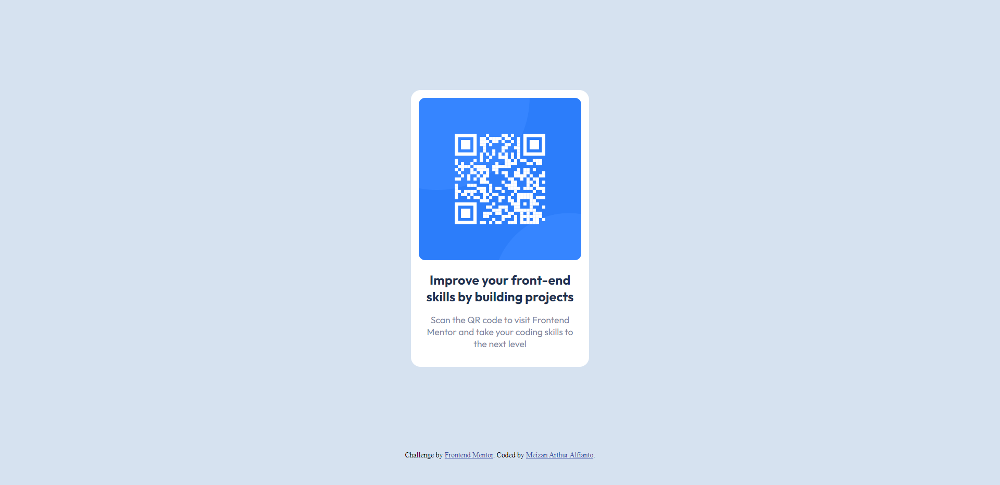

# Frontend Mentor - QR code component solution

This is a solution to the [QR code component challenge on Frontend Mentor](https://www.frontendmentor.io/challenges/qr-code-component-iux_sIO_H). Frontend Mentor challenges help you improve your coding skills by building realistic projects. 

## Table of contents

- [Overview](#overview)
  - [Screenshot](#screenshot)
  - [Links](#links)
- [My process](#my-process)
  - [Built with](#built-with)
  - [What I learned](#what-i-learned)
  - [Continued development](#continued-development)
  - [Useful resources](#useful-resources)
- [Author](#author)

## Overview

### Screenshot

### Links

- Solution URL: [Repository URL](https://github.com/meizanarthur/QR-Code-Component)
- Live Site URL: [Live Site](https://qr-code-component-zan.netlify.app/)

## My process

### Built with

- Semantic HTML5 markup
- CSS custom properties
- Flexbox
- CSS Grid

### What I learned

CSS selectors are used to adding specific styles to HTML components. This project targeted the container, text, h1, p, image, and attribution components with class selectors.

CSS attributes are used to style selected items. Background, border-radius, padding, margin, font-family, font-size, color, font-weight, max-width, and max-height were utilized in this project.

With the viewport meta tag and CSS media queries, it is possible to construct a responsive design that adapts to various screen sizes. The max-width and max-height parameters can also prevent pictures from exceeding their containers' dimensions.

External resources: The HTML link> tag may link external stylesheets and fonts. The img element with the URL and alt attributes may include images on a webpage.

### Continued development

Although this project features a simple layout, CSS layouts can get more complicated when working on larger projects. Mastering CSS Grid, Flexbox, and other layout principles may facilitate the creation of more complex designs and streamline the development process.

With the rising prevalence of mobile devices, it is crucial to building websites suited for all screen sizes. Future projects will benefit from learning more about responsive design and utilising media queries, breakpoints, and other approaches to optimize a website for multiple devices.

Incorporating animations and transitions into a website may improve the user experience and make it more interesting. Knowing how to implement CSS animations and transitions can facilitate the development of more engaging and dynamic websites.

JavaScript may be used to increase a website's interaction and usefulness. Future projects can benefit from learning the fundamentals of JavaScript, including controlling the DOM, adding event listeners, and performing API calls.

## Author

- Frontend Mentor - [@meizanarthur](https://www.frontendmentor.io/profile/meizanarthur)
